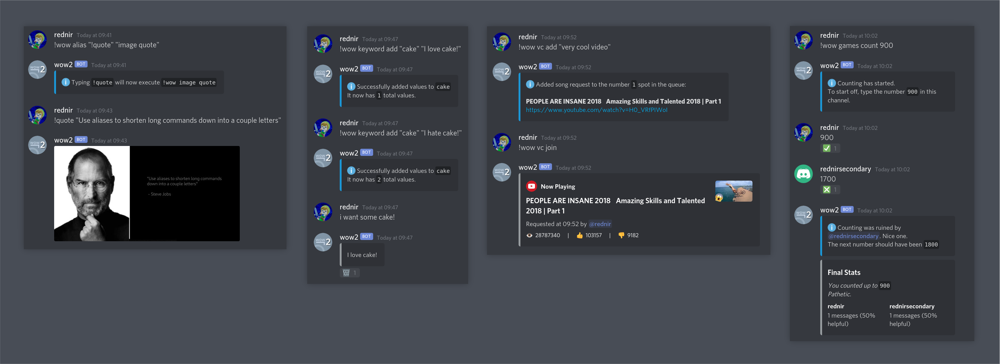

# wow2
A Discord bot written in C# using the [Discord.NET](https://github.com/discord-net/Discord.Net) library.

## Using the bot
Link to invite the bot to a server:
 - https://discord.com/oauth2/authorize?client_id=818156344594792451&permissions=8&scope=bot

Once the bot has joined, you can type `!wow help` in any text channel to view a list of commands.

### What can it do?
Stuff

## Hosting the bot yourself
Download the executable from the [releases page](https://github.com/rednir/wow2/releases/)

To host the bot, you must have a bot token. Make sure you have created an application [here](https://discord.com/developers/applications), and added a bot user to it with sufficient privileges.

### Dependencies
- .NET 5.0
- For voice commands: `libsodium`, `opus`, `ffmpeg`, `youtube-dl`
	- For Windows users, the necessary binaries are already included in the release `.zip` file.
	- Windows users should install [Microsoft Visual C++ 2010 Redistributable Package](https://www.microsoft.com/en-US/download/details.aspx?id=5555)
	- You may set custom executable paths with the `FFMPEG_PATH` and `YOUTUBE_DL_PATH` environment variables.
