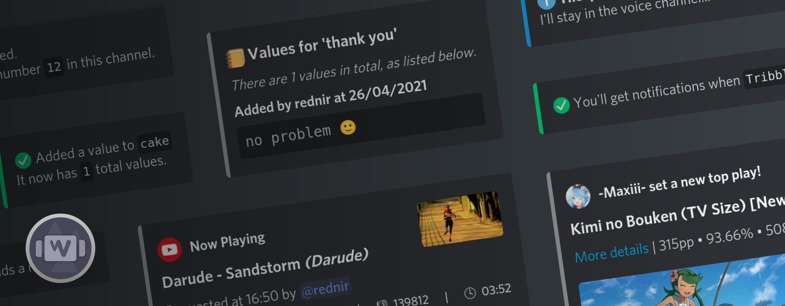

# wow2
A Discord bot written in C# using the [Discord.NET](https://github.com/discord-net/Discord.Net) library.

## Using the bot
Link to invite the bot:
 - https://discord.com/api/oauth2/authorize?client_id=818156344594792451&permissions=37022788&scope=bot

Once the bot has joined, you can type `!wow help` in any text channel to view a list of commands.

## Hosting the bot yourself
Download and run the executable from the [releases page](https://github.com/rednir/wow2/releases/)

At the very least, you need:
 - the [.NET 5.0](https://dotnet.microsoft.com/download) runtime installed.
 - a bot token, which you can get [from this site](https://discord.com/developers/applications)

The below is already included in Windows releases. Otherwise, you'll need them if you want to use voice commands.
 - `libsodium`
 - `opus`
 - `ffmpeg`
 - `youtube-dl`