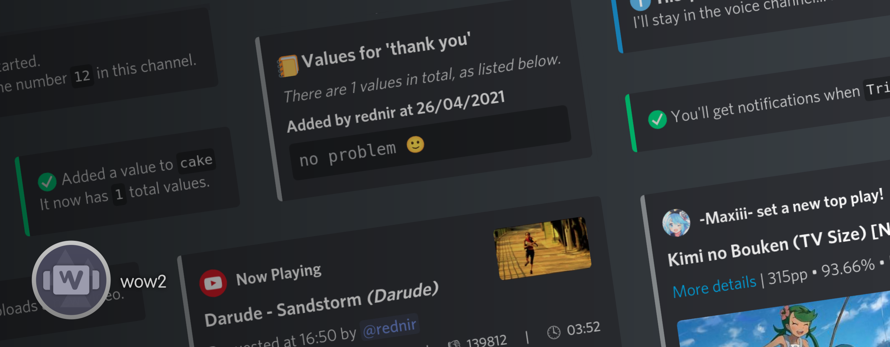

    A Discord bot written in C# using <a href="https://github.com/discord-net/Discord.Net">Discord.NET</a>

    
    

## Using the bot
Invite the bot to a server with this link:
 - https://discord.com/api/oauth2/authorize?client_id=818156344594792451&permissions=8&scope=bot

Then type `!wow help` in that server to get started, or view [COMMANDS.md](COMMANDS.md)

## Hosting the bot yourself
Download and run the executable from the [releases page](https://github.com/rednir/wow2/releases/)

At the very least, you need:
 - the [.NET 5.0](https://dotnet.microsoft.com/download) runtime installed.
 - a bot token, which you can get [from this site](https://discord.com/developers/applications)

The below is already included in Windows releases. Otherwise, you'll need them if you want to use voice commands.
 - `libsodium`
 - `opus`
 - `ffmpeg`
 - `youtube-dl`
